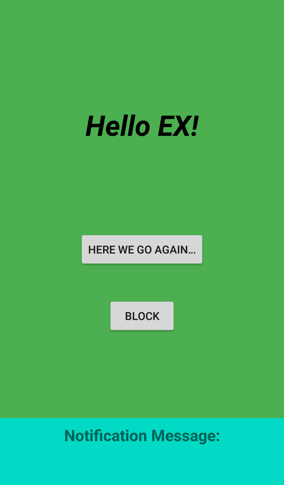

# Fragments, Activity Lifecycle & Rotation by Jason Yan

Rebuild Dotify music app with fragments and run on one activity. Manage the Lifecycle of fragments with the supportFragmentManager as well as manage fragment's display using the back stack.
Support phone rotation with fragment's/activity's state stored.

## Screenshot

